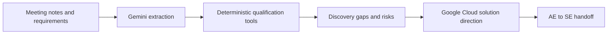

# SignalForge AI

**Agentic opportunity intelligence for enterprise AI sales teams.**

SignalForge AI converts unstructured customer material into an evidence-backed opportunity workspace: confirmed requirements, missing discovery questions, risks, initial Google Cloud solution direction, and an AE-to-SE handoff.

> **Current status:** Mock-mode MVP foundation. Live Vertex AI validation will be completed inside the Build with Gemini sandbox. All customer names and documents in this repository are synthetic.

## Why it exists

CRM systems store what sellers enter. SignalForge first reads the raw meeting notes and requirement documents, then structures, evaluates, and acts on the opportunity automatically.



## What the agent does

1. **Observe** — parses DOCX, CSV, TXT, and Markdown inputs.
2. **Interpret** — extracts an evidence-backed opportunity profile.
3. **Evaluate** — calculates discovery coverage and material risk.
4. **Decide** — selects the appropriate next sales-engineering action.
5. **Act** — produces solution direction, architecture, and handoff artifacts.
6. **Verify** — validates all outputs with Pydantic schemas and deterministic rules.

## MVP workspace

- Executive opportunity overview
- Stakeholder map
- Evidence-linked requirements
- Discovery completeness score
- Prioritized missing questions
- Commercial, security, delivery, and technical risks
- Controlled Google Cloud service mapping
- Generated architecture view
- Markdown, JSON, and DOCX exports

## Architecture

```text
Streamlit UI
    ↓
Opportunity Orchestrator
    ↓
Document Parser → Gemini Provider
    ↓
Validated Opportunity Schema
    ↓
Coverage + Risk + Decision + Service Mapping Tools
    ↓
Dashboard + Architecture + Exported Handoff
```

The model interprets language. Python handles file parsing, scoring, severity rules, service-catalog lookup, decision gates, and exports.

## One codebase, two modes

### Local mock mode

```bash
python -m venv .venv
source .venv/bin/activate
pip install -r requirements.txt
APP_MODE=mock streamlit run app.py
```

Mock mode needs no GCP account. It runs the complete workflow with deterministic synthetic extraction.

### GCP / Vertex mode

```bash
export APP_MODE=vertex
export GOOGLE_CLOUD_PROJECT="$(gcloud config get-value project)"
export GOOGLE_CLOUD_LOCATION=global
export GEMINI_MODEL=gemini-2.5-flash

python scripts/validate_environment.py
streamlit run app.py --server.port 8080 --server.address 0.0.0.0
```

Authentication uses Google Cloud Application Default Credentials. No keys, project IDs, regions, or local paths are hardcoded.

## Cloud Run

```bash
bash scripts/deploy_cloud_run.sh
```

The primary workshop fallback is Cloud Shell Web Preview. Cloud Run is the secondary public-demo path because sandbox permissions may vary.

## Testing

```bash
pytest -q
```

Current tests cover document parsing, discovery gaps, deterministic risk rules, and the full mock workflow.

## Repository map

```text
agent/          workflow orchestration
config/         runtime settings and controlled service catalog
providers/      mock and Vertex AI providers
schemas/        validated opportunity data contracts
tools/          deterministic agent tools
sample_data/    synthetic demo opportunity
tests/          unit and integration tests
scripts/        local, packaging, validation, and deployment commands
```

## Portfolio roadmap

SignalForge is the agentic front door to a broader technical-commercial AI infrastructure portfolio:

```text
SignalForge AI
      ↓
Opportunity Discovery Workbench
      ↓
Capacity and Commercial Sizing
      ↓
Infrastructure TCO and ROI
```

Planned extensions include Google Drive ingestion, Google Docs output, CRM synchronization, capacity sizing, and business-case generation. These are intentionally outside the workshop MVP until the core workflow is validated.

## Disclaimer

This is a portfolio prototype, not production sales, security, or architecture advice. Final cloud architecture requires validated workload, security, compliance, capacity, and commercial requirements.
